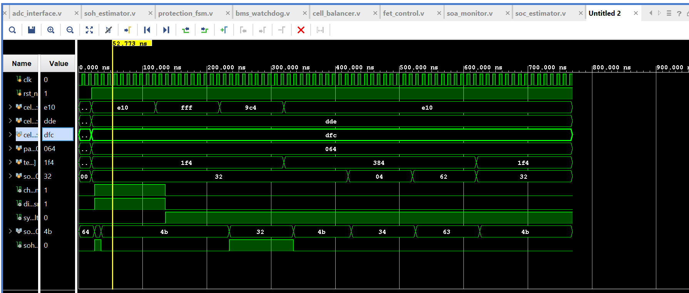
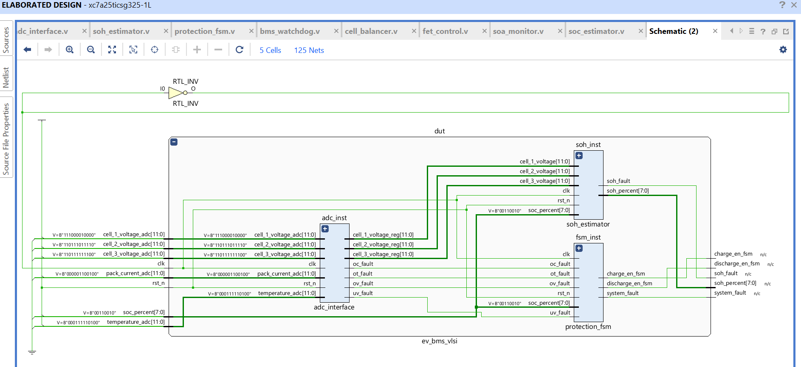
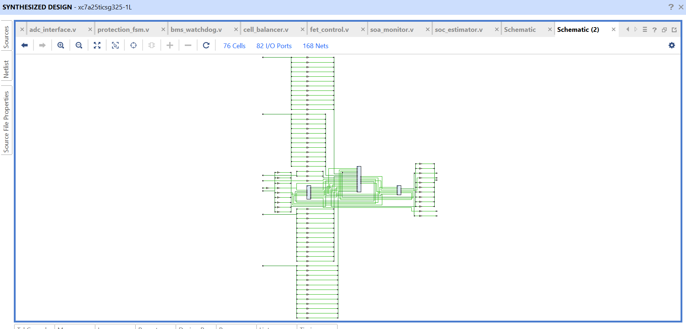
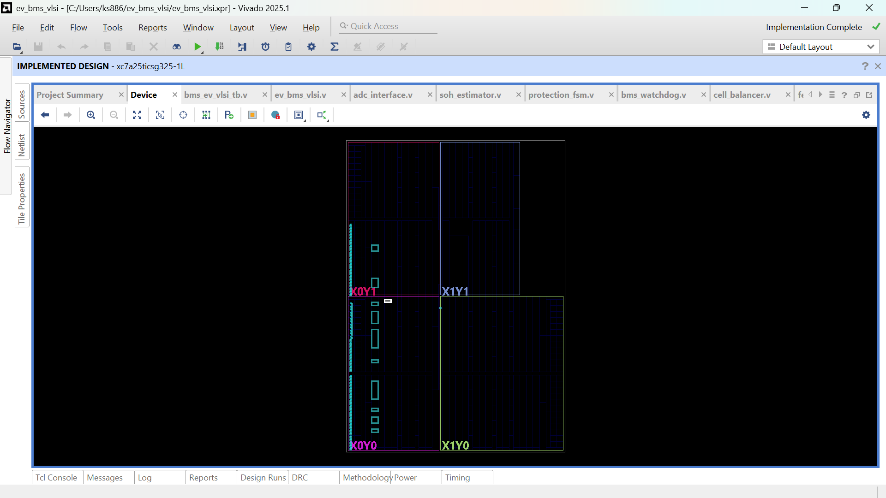

⚙️ Design Methodology
       Modular RTL architecture
       Synchronous FSM design
       Parameterized threshold limits
       Fault-priority handling mechanism
       Structured testbench verification
       Safety-oriented digital control logic

📐 Key Design Concepts Used
      Finite State Machine (FSM) Design
      Fault Detection & Masking
      Digital Protection Logic
      Safe Operating Area Monitoring
      Synchronous Reset Design
      Modular Integration Strategy
---

## 📊 Behavioral Simulation

The waveform below demonstrates normal operation, SOC variation,
charge/discharge control, and fault detection behavior.

---

## 🧱 RTL Synthesis View

Post-synthesis RTL schematic generated in Vivado.

---

## 🏗 Implementation View

Post-implementation placement on Artix-7 device (xc7a25tcsg325-1L).

---

## 🖥 Device Floorplanning View

FPGA device utilization and placement view.

